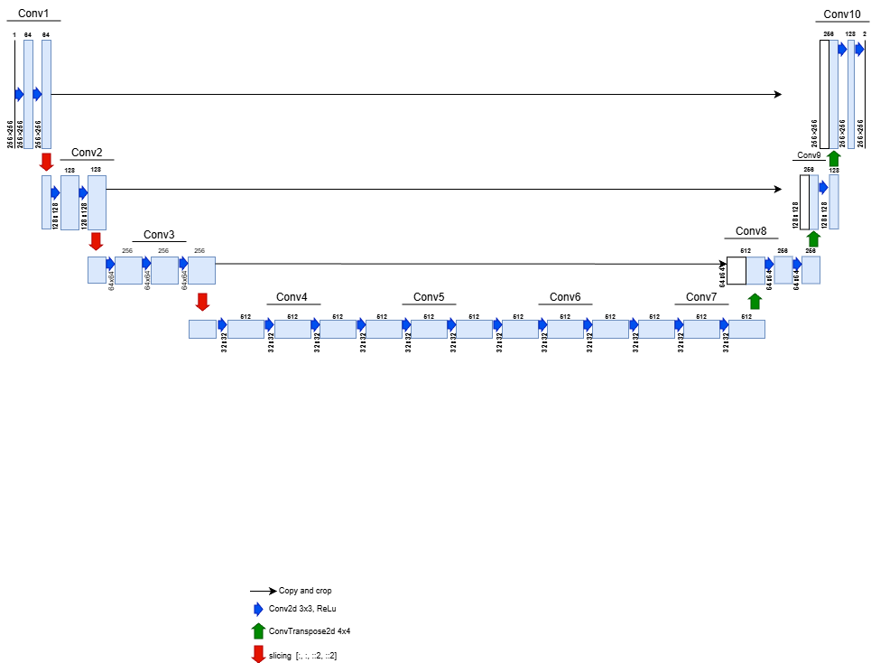

# SIGGRAPH17 Image Colorization with GAN (PyTorch)

This repository implements an **automatic image colorization system** based on the **SIGGRAPH 2017 architecture**, enhanced with a **GAN framework (Generator–Discriminator)** to improve color realism and perceptual quality.

The model learns to predict color information (**ab channels**) from a grayscale image (**L channel**) in the **CIELAB (Lab) color space**.

---

## 1. Overview

### Task

* **Automatic Image Colorization**

### Color Space

* **Lab (CIELAB)**

### Input

* **L channel** (Lightness – grayscale image)

### Output / Target

* **ab channels** (chrominance information)

The task is formulated as a supervised regression problem:

```
L  →  ab
```

---

## 2. Model Architecture

### Generator

* **SIGGRAPHGenerator**
* Based on the **SIGGRAPH 2017 image colorization network**
* Encoder–decoder structure with **skip connections**
* Input: L channel
* Output: ab channels

### Discriminator

* **NLayerDiscriminator (PatchGAN-style)**
* Operates on local image patches
* Encourages realistic and spatially consistent colorization

### Overall Framework

* **GAN-based training**
* Generator predicts color (ab)
* Discriminator distinguishes between:

  * Real color images (ground truth)
  * Generated color images (from Generator)

---

### Model Architecture Diagram

Below is the architecture of the SIGGRAPH-based Generator used in this project:


> **Note**:
>
> * The network follows a U-Net–like design
> * Long skip connections preserve spatial structure
> * Deeper layers capture high-level semantic information

---

## 3. Dataset

* **Dataset**: **COCO 2017**
* Images are stored as **RGB color images**
* During preprocessing:

  * RGB images are converted to **Lab color space**
  * The **L channel** is used as input
  * The **ab channels** are used as ground-truth targets

### Training Objective

Learn a mapping from grayscale structure to plausible color distributions:

```
L (grayscale) → ab (color)
```

---

## 4. Training Strategy

* **Generator**:

  * Initialized from **pretrained SIGGRAPH 2017 weights**
  * Further **fine-tuned** within a GAN framework

* **Discriminator**:

  * Trained **from scratch**
  * Optimized jointly with the Generator

* **Loss Functions**:

  * Color reconstruction loss (L1 / Charbonnier loss on ab channels)
  * Adversarial loss (LSGAN)

---

## 5. Technologies Used

* **Programming Language**: Python
* **Notebook Environment**: Jupyter Notebook (`.ipynb`)
* **Python Version**: 3.8 or higher
* **Deep Learning Framework**: PyTorch

### Key Libraries

* `torch`, `torchvision`
* `numpy`, `pandas`
* `Pillow (PIL)`
* `scikit-image`
* `opencv-python`
* `matplotlib`
* `tqdm`

### Supported Operating Systems

* Windows
* macOS
* Linux

---

## 6. Installation Guide

### 6.1 Create Virtual Environment

```bash
python -m venv venv
```

Activate the environment:

```bash
# macOS / Linux
source venv/bin/activate

# Windows
venv\Scripts\activate
```

---

### 6.2 Install Dependencies

```bash
pip install -r requirements.txt
```

---

